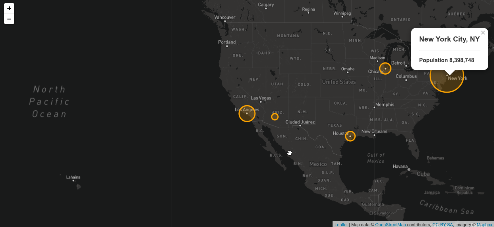

# Mapping Earthquakes

## Aim
The aim of this project is to create an interactive map for graphically displaying earthquake information. The elements of the interface are as follows:

* Circles of varying colours and sizes are placed at locations of earthquakes
* The radius and colour of a circle signifies the magnitude of the related earthquake
* Clicking on a circle brings up a popup marker containing the specific magnitude and location information of the related earthquake

## Last 7 days

Live locations of earthquakes that have occurred in the last 7 days with circle sizes representing earthquake magnitudes. Fault lines are also highlighted.

## Mapping Single Points

Yellow circle of radius 300 meters over Los Angeles

## Mapping Multiple Points

Popup markers on multiple cities on the map

## Mapping Lines

Flights with multiple transit stops

## Mapping GeoJSON LineStrings

Plot lines simulating routes radiating out from a airline hub

## Mapping GeoJSON Points

Popup markers showing airport IATA codes and full airport names

## Mapping GeoJSON Polygons

Demarcating Toronto neighbourhoods 

